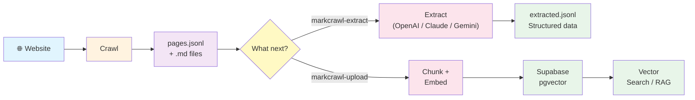

# MarkCrawl by iD8 🕷️📝
### Turn any website into clean Markdown for LLM pipelines — in one command.

[](https://github.com/AIMLPM/markcrawl/actions/workflows/ci.yml)


```bash
pip install markcrawl
markcrawl --base https://docs.example.com --out ./output --show-progress
```

MarkCrawl crawls a website, extracts readable Markdown (not raw HTML), and writes structured JSONL that's ready for RAG, embeddings, competitive research, or any LLM workflow. No API keys needed for the core crawler.

## Why MarkCrawl?

| | MarkCrawl | FireCrawl | Crawl4AI | Scrapy |
|---|---|---|---|---|
| **License** | MIT (free) | AGPL-3.0 | Apache-2.0 | BSD-3 |
| **Install** | `pip install markcrawl` | SaaS or self-host | `pip install` + Playwright setup | `pip install` + learn framework |
| **RAG pipeline** | Built-in (crawl → chunk → embed → Supabase) | Stop at output | Stop at output | Build everything yourself |
| **LLM extraction** | Built-in (OpenAI, Claude, Gemini) | Via API | Built-in | None |
| **MCP server** | Built-in | No | No | No |
| **Complexity** | One command | API config | Async Python | Spiders, pipelines, middleware |

**MarkCrawl is for devs who want the full pipeline** — crawl, extract, embed, store — without stitching together 4 different tools. If you just need a hosted scraping API, use FireCrawl. If you need distributed crawling at massive scale, use Scrapy.

## Quickstart (2 minutes)

```bash
# 1. Install
pip install markcrawl

# 2. Crawl any public website
markcrawl --base https://httpbin.org --out ./demo --show-progress
```

Expected output:

```
[info] sitemap discovered 1 in-scope page(s)
[get ] https://httpbin.org/
[prog] saved 1 | queued=0
```

Your `./demo` folder now contains:

```text
demo/
├── index__a4f3b2c1d0.md    ← clean Markdown of the page
└── pages.jsonl              ← structured index (one JSON line per page)
```

Each line in `pages.jsonl`:

```json
{
  "url": "https://httpbin.org/",
  "title": "httpbin.org",
  "path": "index__a4f3b2c1d0.md",
  "text": "# httpbin.org\n\nA simple HTTP Request & Response Service..."
}
```

That's it. You now have clean, LLM-ready content. Read on for extraction, RAG upload, and MCP integration.

## How it works



| Path | What you get | API keys? |
|---|---|---|
| **Crawl only** | Markdown files + `pages.jsonl` | None (free) |
| **+ Extract** | Structured fields (pricing, features, API endpoints, etc.) | One of: `OPENAI_API_KEY`, `ANTHROPIC_API_KEY`, `GEMINI_API_KEY`, `XAI_API_KEY` |
| **+ RAG upload** | Chunked embeddings in Supabase for vector search | `OPENAI_API_KEY` + Supabase credentials |

## Common use cases

### Competitive research

Crawl 3 competitor sites, auto-discover comparison fields, export to a spreadsheet:

```bash
markcrawl --base https://competitor1.com --out ./comp1 --show-progress
markcrawl --base https://competitor2.com --out ./comp2 --show-progress
markcrawl --base https://competitor3.com --out ./comp3 --show-progress

markcrawl-extract \
  --jsonl ./comp1/pages.jsonl ./comp2/pages.jsonl ./comp3/pages.jsonl \
  --auto-fields \
  --context "competitor pricing and product comparison" \
  --show-progress
```

Output (`extracted.jsonl`):

```json
{"url": "https://competitor1.com/pricing", "company_name": "Acme Inc", "pricing_tiers": "Free, Pro ($49/mo), Enterprise", ...}
{"url": "https://competitor2.com/pricing", "company_name": "Beta Corp", "pricing_tiers": "Starter ($29/mo), Business ($99/mo)", ...}
```

### API documentation analysis

Crawl API docs and extract endpoint details:

```bash
markcrawl --base https://docs.stripe.com/api --out ./stripe-docs --show-progress

markcrawl-extract \
  --jsonl ./stripe-docs/pages.jsonl \
  --fields api_endpoint http_method parameters authentication response_format \
  --show-progress
```

### Build a RAG knowledge base

Crawl a site and make it searchable via vector embeddings:

```bash
markcrawl --base https://docs.example.com --out ./output --show-progress
markcrawl-upload --jsonl ./output/pages.jsonl --show-progress
```

Now any LLM can query your Supabase vector store to answer questions grounded in that site's content. See [docs/SUPABASE.md](docs/SUPABASE.md) for full setup.

### Company research before interviews

```bash
markcrawl --base https://company-you-applied-to.com --out ./research --show-progress

markcrawl-extract \
  --jsonl ./research/pages.jsonl \
  --auto-fields \
  --context "company overview for job interview preparation" \
  --show-progress
```

### Archive internal documentation

```bash
markcrawl \
  --base https://internal-wiki.yourcompany.com \
  --out ./wiki-backup \
  --include-subdomains \
  --format markdown
```

## Installation

**The core crawler is the only thing you need.** Everything else is optional — install only what your workflow requires.

```bash
pip install markcrawl                # Core crawler (free, no API keys)
```

Optional add-ons:

```bash
pip install markcrawl[extract]       # + LLM extraction (OpenAI, Claude, Gemini, Grok)
pip install markcrawl[js]            # + JavaScript rendering (Playwright)
pip install markcrawl[upload]        # + Supabase upload with embeddings
pip install markcrawl[mcp]           # + MCP server for AI agents
pip install markcrawl[langchain]     # + LangChain tool wrappers
pip install markcrawl[all]           # Everything
```

For Playwright, also run `playwright install chromium` after installing.

<details>
<summary>Install from source (for development)</summary>

```bash
git clone https://github.com/AIMLPM/markcrawl.git
cd markcrawl
python -m venv .venv
source .venv/bin/activate
pip install -e ".[all]"
```
</details>

## Architecture — what's core vs optional

MarkCrawl is **one tool: a web crawler that produces clean Markdown**. Everything else is an optional add-on. The core has zero API dependencies and zero cost.

```text
CORE (free, no API keys)              OPTIONAL LAYERS
┌──────────────────────────┐
│ 1. Discover URLs         │          ┌─────────────────────┐
│    (sitemap or links)    │          │ LLM Extraction      │  markcrawl[extract]
│                          │          │ OpenAI/Claude/       │
│ 2. Fetch & clean HTML    │          │ Gemini/Grok         │
│    (strip nav, scripts)  │          └─────────────────────┘
│                          │
│ 3. Transform to Markdown │          ┌─────────────────────┐
│    + write JSONL index   │          │ RAG Upload          │  markcrawl[upload]
│    + auto-citation       │          │ Chunk → Embed →     │
└──────────────────────────┘          │ Supabase/pgvector   │
        ↓ pages.jsonl                 └─────────────────────┘
        ↓ .md files
                                      ┌─────────────────────┐
                                      │ JS Rendering        │  markcrawl[js]
                                      │ Playwright/Chromium │
                                      └─────────────────────┘

                                      AGENTIC INTEGRATIONS
                                      ┌─────────────────────┐
                                      │ MCP Server          │  markcrawl[mcp]
                                      │ Claude/Cursor/      │
                                      │ Windsurf            │
                                      ├─────────────────────┤
                                      │ LangChain Tools     │  markcrawl[langchain]
                                      │ RAG agents/chains   │
                                      ├─────────────────────┤
                                      │ OpenClaw Skill      │  clawhub
                                      │ WhatsApp/Telegram/  │
                                      │ Slack agents        │
                                      └─────────────────────┘
```

For deeper internals (module map, data structures, how to extend), see **[docs/ARCHITECTURE.md](docs/ARCHITECTURE.md)**.

## Crawling

### Basic usage

```bash
markcrawl --base https://www.example.com --out ./output --show-progress
```

### All options

```bash
markcrawl \
  --base https://www.example.com \
  --out ./output \
  --include-subdomains \        # crawl sub.example.com too
  --render-js \                 # render JavaScript (React, Vue, etc.)
  --concurrency 5 \             # fetch 5 pages in parallel
  --proxy http://proxy:8080 \   # route through a proxy
  --max-pages 200 \             # stop after 200 pages
  --format markdown \            # or "text" for plain text
  --show-progress
```

### Resume an interrupted crawl

If a crawl is interrupted (Ctrl+C, crash, or `--max-pages` limit), it saves state automatically:

```bash
markcrawl --base https://www.example.com --out ./output --resume --show-progress
```

### Output examples

After crawling a documentation site, your output directory looks like this:

```text
output/
├── index__6dcd4ce23d.md
├── getting-started__0cc175b9c0.md
├── api-reference__f7c3bc1d09.md
├── api-authentication__e4d909c290.md
├── pricing__2b6d8e15a3.md
└── pages.jsonl
```

**Example `.md` file** (`getting-started__0cc175b9c0.md`):

```markdown
# Getting Started

> URL: https://docs.example.com/getting-started
> Crawled: April 04, 2026
> Citation: Getting Started. docs.example.com. Available at: https://docs.example.com/getting-started [Accessed April 04, 2026].

Welcome to the platform. This guide walks you through installation,
configuration, and making your first API call.

## Installation

Install the SDK using pip:

    pip install example-sdk

## Configuration

Set your API key as an environment variable:

    export EXAMPLE_API_KEY="your-key"

## Your first request

    import example
    client = example.Client()
    response = client.get("/users")
    print(response.json())
```

Notice: navigation, footer, cookie banners, and scripts are stripped. Only the main content remains, converted to clean Markdown with headings preserved. Every page includes a ready-to-use citation with the access date.

**Example `pages.jsonl` row** (one line per page):

```json
{
  "url": "https://docs.example.com/getting-started",
  "title": "Getting Started",
  "path": "getting-started__0cc175b9c0.md",
  "crawled_at": "2026-04-04T12:30:00Z",
  "citation": "Getting Started. docs.example.com. Available at: https://docs.example.com/getting-started [Accessed April 04, 2026].",
  "tool": "markcrawl",
  "text": "Welcome to the platform. This guide walks you through installation, configuration, and making your first API call.\n\n## Installation\n\nInstall the SDK using pip..."
}
```

**Example `extracted.jsonl` row** (after running `markcrawl-extract`):

```json
{
  "url": "https://docs.example.com/api-authentication",
  "title": "API Authentication",
  "crawled_at": "2026-04-04T12:30:00Z",
  "citation": "API Authentication. docs.example.com. Available at: https://docs.example.com/api-authentication [Accessed April 04, 2026].",
  "auth_methods": "API key, OAuth 2.0, JWT tokens",
  "api_key_location": "Authorization header as Bearer token",
  "rate_limit": "1000 requests per minute",
  "sdk_support": "Python, Node.js, Go, Ruby",
  "extracted_by": "gpt-4o-mini (openai)",
  "extraction_note": "Field values were extracted by an LLM and may be interpreted, not verbatim."
}
```

**Example chunk structure** (what `markcrawl-upload` sends to Supabase):

Each page is split into overlapping chunks for embedding. A 1,200-word page becomes:

```text
Chunk 0/3 (400 words): "Welcome to the platform. This guide walks you through..."
Chunk 1/3 (400 words): "...environment variable. You can also pass it directly..."  ← 50 words overlap
Chunk 2/3 (350 words): "...response = client.get('/users'). For advanced usage..."  ← 50 words overlap
```

Each chunk is embedded as a 1536-dimensional vector and stored with its URL, title, and chunk index for retrieval.

<details>
<summary>All crawler CLI arguments</summary>

| Argument | Description |
|---|---|
| `--base` | Base site URL to crawl |
| `--out` | Output directory |
| `--format` | `markdown` or `text` (default: `markdown`) |
| `--show-progress` | Print progress and crawl events |
| `--render-js` | Render JavaScript with Playwright before extracting |
| `--concurrency` | Pages to fetch in parallel (default: `1`) |
| `--proxy` | HTTP/HTTPS proxy URL |
| `--resume` | Resume from saved state |
| `--include-subdomains` | Include subdomains under the base domain |
| `--max-pages` | Max pages to save; `0` = unlimited (default: `500`) |
| `--delay` | Delay between requests in seconds (default: `1.0`) |
| `--timeout` | Per-request timeout in seconds (default: `15`) |
| `--min-words` | Skip pages with fewer words (default: `20`) |
| `--user-agent` | Override the default user agent |
| `--use-sitemap` / `--no-sitemap` | Enable/disable sitemap discovery |
</details>

## Structured extraction

The crawler gives you full page text. The extraction step uses an LLM to pull out **specific structured fields** — turning hundreds of pages into a spreadsheet-ready dataset.

**Without extraction** — raw text you'd have to read manually:

```json
{
  "url": "https://competitor.com/pricing",
  "text": "Pricing Plans\n\nStarter\n$29/month\nUp to 1,000 API calls...\n\nPro\n$99/month..."
}
```

**With extraction** — structured data you can compare instantly:

```json
{
  "url": "https://competitor.com/pricing",
  "pricing_tiers": "Starter ($29/mo), Pro ($99/mo), Enterprise (contact sales)",
  "lowest_price": "$29/month",
  "api_included": "Yes, REST API on all plans",
  "contact_email": "sales@competitor.com"
}
```

### Auto-discover fields

Don't know what fields to look for? Pass multiple crawled sites and let the LLM suggest fields that work for cross-site comparison:

```bash
markcrawl-extract \
  --jsonl ./comp1/pages.jsonl ./comp2/pages.jsonl ./comp3/pages.jsonl \
  --auto-fields \
  --context "competitor pricing and product analysis" \
  --show-progress
```

### Specify fields manually

```bash
markcrawl-extract \
  --jsonl ./output/pages.jsonl \
  --fields company_name pricing features api_endpoints \
  --show-progress
```

### Choose your LLM provider and model

```bash
markcrawl-extract --jsonl ... --fields pricing --provider openai                        # default
markcrawl-extract --jsonl ... --fields pricing --provider anthropic                     # Claude
markcrawl-extract --jsonl ... --fields pricing --provider gemini                        # Gemini
markcrawl-extract --jsonl ... --fields pricing --provider grok                          # Grok
markcrawl-extract --jsonl ... --fields pricing --provider openai --model gpt-4o         # override model
```

| Provider | API key env var | Default model | Other options |
|---|---|---|---|
| OpenAI | `OPENAI_API_KEY` | `gpt-4o-mini` | `gpt-4o`, `gpt-4.1-mini`, `gpt-4.1` |
| Anthropic (Claude) | `ANTHROPIC_API_KEY` | `claude-sonnet-4-20250514` | `claude-opus-4-20250514`, `claude-haiku-4-20250414` |
| Google Gemini | `GEMINI_API_KEY` | `gemini-2.0-flash` | `gemini-2.5-pro`, `gemini-2.5-flash` |
| xAI (Grok) | `XAI_API_KEY` | `grok-3-mini-fast` | `grok-3`, `grok-3-fast`, `grok-3-mini` |

<details>
<summary>All extraction CLI arguments</summary>

| Argument | Description |
|---|---|
| `--jsonl` | Path(s) to `pages.jsonl` — pass multiple for cross-site analysis |
| `--fields` | Field names to extract (space-separated) |
| `--auto-fields` | Auto-discover fields by sampling pages (mutually exclusive with `--fields`) |
| `--context` | Describe your goal to improve auto-discovery (e.g. `"competitor analysis"`) |
| `--sample-size` | Pages to sample for auto-discovery (default: `3`, spread across all input files) |
| `--provider` | `openai`, `anthropic`, or `gemini` (default: `openai`) |
| `--model` | Override the default model for your provider |
| `--output` | Output path (default: `extracted.jsonl` in first input's directory) |
| `--show-progress` | Print progress |
</details>

## Supabase vector search (RAG)

MarkCrawl can chunk your crawled pages, generate embeddings, and upload them to Supabase with pgvector for semantic search — the full RAG pipeline:

```bash
markcrawl --base https://docs.example.com --out ./output --show-progress
markcrawl-upload --jsonl ./output/pages.jsonl --show-progress
```

Requires `SUPABASE_URL`, `SUPABASE_KEY`, and `OPENAI_API_KEY` environment variables.

For full setup instructions including table creation SQL, vector search queries, and Python examples, see **[docs/SUPABASE.md](docs/SUPABASE.md)**.

## Agentic integrations

MarkCrawl is built for the agent-first era. Every piece of extracted Markdown includes source URL metadata, so LLM responses built on MarkCrawl output are always citable and verifiable.

### MCP Server — Claude Desktop, Cursor, Windsurf

```bash
pip install markcrawl[mcp]
```

```json
{
  "mcpServers": {
    "markcrawl": {
      "command": "python",
      "args": ["-m", "markcrawl.mcp_server"]
    }
  }
}
```

| MCP Tool | Description |
|---|---|
| `crawl_site` | Crawl a website and save content |
| `list_pages` | List all crawled pages with titles and word counts |
| `read_page` | Read full content of a specific page by URL |
| `search_pages` | Search crawled pages by keyword |
| `extract_data` | Extract structured fields using an LLM |

<details>
<summary>Example agent conversation</summary>

> **You:** "Crawl the Stripe API docs and tell me about their authentication methods."
>
> **Agent** (uses `crawl_site`): Crawled 87 pages from https://docs.stripe.com/
>
> **Agent** (uses `search_pages` with query "authentication"): Found 5 results...
>
> **Agent** (uses `read_page`): *reads the full auth page*
>
> **Agent:** "Stripe supports three authentication methods: API keys, OAuth 2.0, and..."
</details>

### LangChain Tool — custom RAG agents and chains

```bash
pip install markcrawl[langchain]
```

```python
from markcrawl.langchain import crawl_tool, search_tool, read_tool, extract_tool, all_tools

# Use individual tools
from langchain_openai import ChatOpenAI
from langchain.agents import initialize_agent, AgentType

llm = ChatOpenAI(model="gpt-4o-mini")
agent = initialize_agent(
    tools=all_tools,
    llm=llm,
    agent=AgentType.STRUCTURED_CHAT_ZERO_SHOT_REACT_DESCRIPTION,
)
agent.run("Crawl docs.example.com and summarize their authentication guide")
```

Five tools are available: `crawl_tool`, `search_tool`, `read_tool`, `list_tool`, `extract_tool` — or use `all_tools` to include them all.

### OpenClaw Skill — WhatsApp, Telegram, Slack agents

```bash
npx clawhub install markcrawl-skill
```

Once installed, message your OpenClaw agent from any chat app:

> **You:** "Hey, crawl the iD8 documentation and summarize the new API features."
>
> **OpenClaw:** *(Crawls site, extracts Markdown, summarizes)*
>
> "iD8's latest API adds three new endpoints: /analyze, /extract, and /summarize..."

See full docs at [AIMLPM/markcrawl-clawhub-skill](https://github.com/AIMLPM/markcrawl-clawhub-skill).

### Auto-citation

Every output includes a ready-to-use academic-style citation with access date:

- **`.md` files** include URL, crawl date, and full citation in the header
- **`pages.jsonl`** includes `"crawled_at"` (ISO 8601) and `"citation"` on every row
- **`extracted.jsonl`** includes `"url"` and `"source_file"` for multi-site analysis

Citation format:

> *Page Title*. website.com. Available at: https://website.com/page [Accessed April 04, 2026].

When an LLM uses MarkCrawl data to answer a question, the citation is always available — no need to reconstruct it after the fact.

### LLM assistant prompt

Want an AI that knows how to use MarkCrawl? Copy the system prompt from **[docs/LLM_PROMPT.md](docs/LLM_PROMPT.md)** into Claude, ChatGPT, or any LLM. It includes every command, flag, workflow, and troubleshooting step — so the AI generates correct commands instead of hallucinating features.

### Using as a Python library

See [Extending MarkCrawl](#extending-markcrawl) below and [docs/ARCHITECTURE.md](docs/ARCHITECTURE.md) for using MarkCrawl programmatically in your own pipelines.

## When NOT to use MarkCrawl

- **JavaScript-heavy SPAs without `--render-js`** — The base crawler fetches raw HTML. If a site renders content client-side (React, Vue, Angular), you need `pip install markcrawl[js]` and `--render-js`, which is slower.
- **Sites behind login/auth** — MarkCrawl doesn't handle authentication, cookies, or session management.
- **Sites with aggressive bot protection** — Cloudflare, Akamai, and similar anti-bot systems will block MarkCrawl. It has no fingerprinting or CAPTCHA solving.
- **Crawling millions of pages** — MarkCrawl is designed for single-site crawls (hundreds to low thousands of pages). For massive distributed crawling, use Scrapy or Colly.
- **PDF or non-HTML content** — MarkCrawl only extracts from HTML pages. PDF support is on the roadmap.

## Cost

The crawler is **completely free** — crawling, Markdown extraction, chunking, resume, JS rendering, and proxy support use no paid APIs.

Two optional features have API costs:

| Feature | Cost | When |
|---|---|---|
| Structured extraction | ~$0.01-0.03 per page | `markcrawl-extract` |
| Supabase upload | ~$0.0001 per page | `markcrawl-upload` |

## Setting up API keys

All credentials are read from environment variables — never passed as CLI arguments. You only need keys for the features you use. **The core crawler needs no keys.**

**Option A: Create a `.env` file** (recommended for projects)

Create a file called `.env` in the directory where you run MarkCrawl:

```bash
# .env — put this in your project/working directory
OPENAI_API_KEY="sk-..."           # For extraction (--provider openai) and Supabase upload
ANTHROPIC_API_KEY="sk-ant-..."    # For extraction (--provider anthropic)
GEMINI_API_KEY="AI..."            # For extraction (--provider gemini)
XAI_API_KEY="xai-..."             # For extraction (--provider grok)
SUPABASE_URL="https://..."        # For Supabase upload
SUPABASE_KEY="eyJ..."             # For Supabase upload (use service-role key)
```

Load it before running:

```bash
source .env
markcrawl-extract --jsonl ./output/pages.jsonl --fields pricing --show-progress
```

> **Note:** `.env` is already in MarkCrawl's `.gitignore`, but make sure it's also in your own project's `.gitignore` so you never accidentally commit API keys.

**Option B: Add to your shell profile** (always available)

Add `export` lines to `~/.zshrc` (macOS) or `~/.bashrc` (Linux):

```bash
export OPENAI_API_KEY="sk-..."
```

Then restart your terminal or run `source ~/.zshrc`.

## Project structure

<details>
<summary>Click to expand</summary>

```text
.
├── README.md
├── LICENSE
├── .gitignore
├── requirements.txt
├── CONTRIBUTING.md
├── CODE_OF_CONDUCT.md
├── SECURITY.md
├── docs/
│   └── SUPABASE.md
├── tests/
│   ├── test_core.py
│   └── test_chunker.py
└── markcrawl/
    ├── __init__.py
    ├── cli.py
    ├── core.py
    ├── chunker.py
    ├── upload.py
    ├── upload_cli.py
    ├── extract.py
    ├── extract_cli.py
    └── mcp_server.py
```
</details>

## Extending MarkCrawl

### Simplest usage — 3 lines

```python
from markcrawl import crawl

result = crawl("https://example.com", out_dir="./output")
print(f"Saved {result.pages_saved} pages")
```

That's it. `crawl()` returns a `CrawlResult` with `pages_saved`, `output_dir`, and `index_file`.

### Process crawl output in your own pipeline

```python
from markcrawl import crawl
import json

result = crawl("https://docs.example.com", out_dir="./output", fmt="markdown", max_pages=50)

with open(result.index_file) as f:
    for line in f:
        page = json.loads(line)
        # page["url"], page["title"], page["text"], page["citation"]
        your_db.insert(page)           # Pinecone, Weaviate, Elasticsearch, etc.
```

### Use individual components

```python
from markcrawl import chunk_text                           # Chunk text for embeddings
from markcrawl.extract import LLMClient, extract_fields   # LLM extraction
from markcrawl.langchain import all_tools                  # LangChain tools
```

```python
# Chunk independently
chunks = chunk_text("Your long document text...", max_words=400, overlap_words=50)
for chunk in chunks:
    embed(chunk.text)  # Send to your embedding API

# Extract with any provider
client = LLMClient(provider="anthropic")
result = extract_fields(
    text="Page content here...",
    fields=["company_name", "pricing"],
    client=client,
)
# {"company_name": "Acme", "pricing": "$29/mo"}
```

For full extensibility docs (custom storage adapters, swap output formats, module map), see **[docs/ARCHITECTURE.md](docs/ARCHITECTURE.md)**.

## Roadmap

What's next for MarkCrawl:

- [ ] Canonical URL support — deduplicate pages with different URLs pointing to the same content
- [ ] Duplicate-content detection — fuzzy matching beyond exact hash deduplication
- [ ] PDF support — extract text from PDF files linked on crawled sites
- [ ] Authenticated crawling — cookie/session support for login-protected sites
- [ ] Multi-provider embeddings — use Anthropic, Gemini, or Grok for embeddings (not just OpenAI)

<details>
<summary>Shipped features</summary>

- Package publishing (`pip install markcrawl`)
- 44 automated tests + GitHub Actions CI (Python 3.10-3.13)
- Markdown and plain text output with auto-citation
- Sitemap-first crawling with robots.txt compliance
- Text chunking with configurable overlap
- Supabase / pgvector upload for RAG
- JavaScript rendering via Playwright
- Concurrent fetching and proxy support
- Resume interrupted crawls
- LLM-powered structured extraction (OpenAI, Claude, Gemini, Grok)
- Auto-field discovery across multiple sites
- MCP server, LangChain tools, OpenClaw skill
</details>

## Contributing

Please read [CONTRIBUTING.md](CONTRIBUTING.md) before opening a pull request. If you used an LLM to generate code, include the prompt in your PR — see the PR template for details.

## Security

If you discover a security issue, please follow the instructions in [SECURITY.md](SECURITY.md).

## Privacy

MarkCrawl runs entirely on your local machine. It collects no telemetry, analytics, or usage data. See [PRIVACY.md](PRIVACY.md) for full details on what data is accessed when using optional features like LLM extraction and Supabase upload.

## License

MIT License. See [LICENSE](LICENSE).
